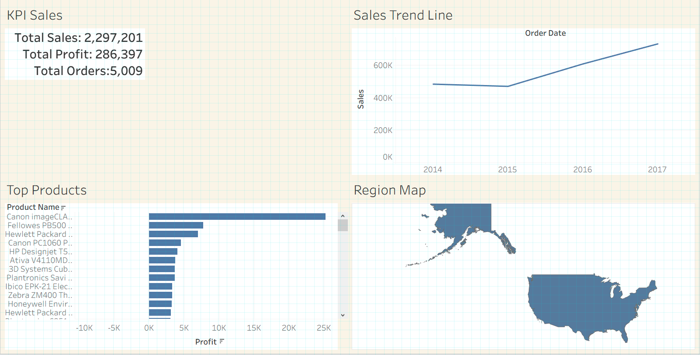

# Retail Sales & Customer Analytics Dashboard

## Overview
Analyzed 10,000+ retail orders to uncover sales trends, top-performing products, and shipping delays, using Python for cleaning/EDA, SQL for KPI extraction, and Tableau for an interactive executive dashboard.

## Key Findings
- **Product Profitability**: Identified top 10 products driving 23.2% of total profit ($66,478.78 out of $286,397.02 total profit).
- **Logistics Bottleneck**: Central region recorded the highest shipping delay, 2.5% above the overall average delay (4.06 days).
- **Seasonal Sales Trend**: Revealed a strong Q4 seasonal spike with sales reaching $179,627.73 (+141% surge compared to Q1).

## Tech Stack
Python (Pandas, Matplotlib) · SQL (SQLite) · Tableau

## Dashboard
